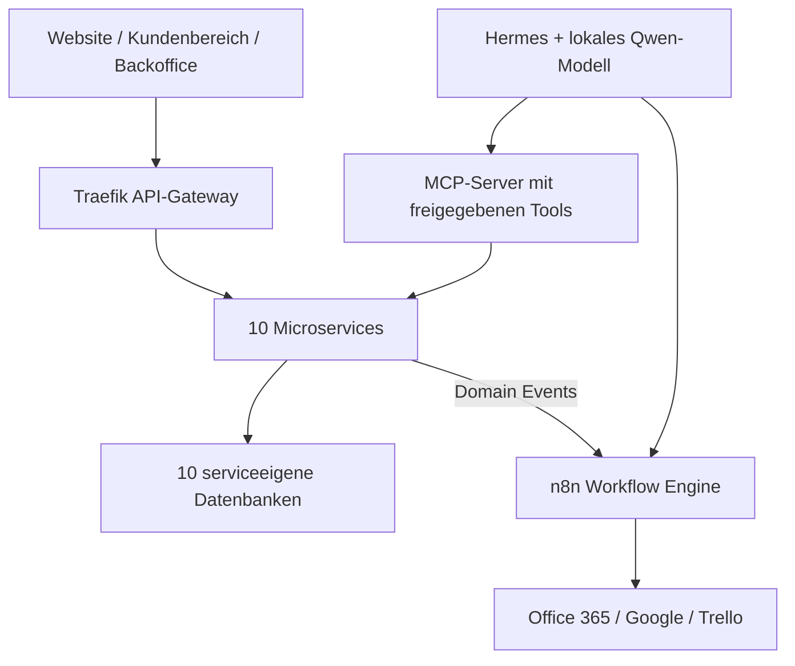

# Videoanalyse: AI-Engineering-Prozess von David Tielke

Quelle: [Der Moment, der die Softwareentwicklung verändert hat](https://www.youtube.com/watch?v=eLDHrqKplVI)

Das Entscheidende im Video ist nicht Claude, Codex oder ein besonders guter Prompt. Es ist ein „AI Engineering Operating System“: Anforderungen definieren das Was, der Harness definiert das Wie, und automatisierte Tests sowie statische Analysen entscheiden, ob das Ergebnis akzeptiert wird.

## 1. Das Grundmodell

Der Entwickler trennt drei Wahrheiten konsequent:

| Ebene | Inhalt | Zweck |
|---|---|---|
| Spezifikationen | Ideen, User Stories, Akzeptanzkriterien | Was soll das System tun? |
| Harness | Architektur-, Coding-, Test- und Betriebsregeln | Wie muss es umgesetzt werden? |
| Evidence | Tests, statische Analyse, Strukturprüfung | Ist es tatsächlich korrekt? |

Der Code ist damit nicht mehr die primäre Wahrheit. Er ist ein regenerierbares Ergebnis aus Spezifikation und Harness.

Der sogenannte Harness ist keine einzelne Promptdatei. Er besteht aus mehreren Dateien, Werkzeugen und Prozessen. Bei jeder neuen Agentensitzung wird daraus Kontext beziehungsweise ein Systemprompt erzeugt. Abweichungen werden nicht nur im Code repariert, sondern möglichst im Harness, damit derselbe Fehler nicht wiederholt wird. Er nennt das „Harness Correction Development“. [Video ab 15:37](https://www.youtube.com/watch?v=eLDHrqKplVI&t=937s)

## 2. Seine Systemarchitektur

Die fachliche Anwendung besteht aus:

- öffentlicher Website,
- Kundenbereich,
- Backoffice,
- zehn Microservices,
- jeweils eigener Datenbank pro Service,
- Traefik als API-Gateway,
- Domain Events zwischen den Services,
- n8n als Workflow- und Prozess-Orchestrator,
- Office 365, Google und Trello als externe Systeme,
- lokalem KI-Modell,
- Hermes als operativem Agenten,
- MCP-Server als kontrolliertem Werkzeugzugang zur Anwendung.



Hermes soll Rechnungen anlegen, Belege verbuchen und Teile der Kundenkommunikation übernehmen. Wegen sensibler Kundendaten soll dieser operative Agent lokal laufen. Als Modell nennt er ein lokales Alibaba-Qwen-MoE-Modell mit ungefähr 36 Milliarden Parametern. [Architektur und lokale KI ab 08:16](https://www.youtube.com/watch?v=eLDHrqKplVI&t=496s)

Wichtig: Er sagt ausdrücklich, dass er die Microservice-Architektur fachlich nicht benötigt. Sie dient auch als Demonstrationssystem für seine Architekturworkshops. Für unseren Nachbau sollten wir deshalb zunächst einen modularen Monolithen erwägen. Wir sollten die Methode kopieren, nicht automatisch die Topologie.

## 3. Coding-Agenten und Assistenten

Im Video verwendet er:

- zunächst viel Codex,
- später fast ausschließlich Claude Code,
- ergänzend lokale Modelle,
- Hermes als späteren operativen Fachagenten.

Claude Code habe seine umfangreichen Guidelines zuverlässiger befolgt. Das entscheidende Auswahlkriterium ist also nicht die höchste allgemeine Modellintelligenz, sondern Instruktionstreue über lange Arbeitsabläufe. [Agentensetup ab 11:14](https://www.youtube.com/watch?v=eLDHrqKplVI&t=674s)

Er beschreibt keine Sammlung explizit benannter Subagenten. Die Rollen entstehen funktional durch die Phasen des Harnesses. Für unseren Nachbau würde ich sie explizit trennen:

1. **Requirements-Interviewer**  
   Diskutiert Ideen kritisch und erzeugt fachliche Anforderungen.

2. **Spezifikations-Agent**  
   Erstellt User Stories und messbare Akzeptanzkriterien.

3. **Architektur-/Planungs-Agent**  
   Zerlegt Stories in technische Aufgaben und prüft Servicegrenzen.

4. **Testdesigner**  
   Erstellt Tests aus Anforderungen, niemals aus bereits geschriebenem Code.

5. **Implementierungs-Agent**  
   Darf nur innerhalb eines freigegebenen Plans arbeiten.

6. **Verifikations-Agent**  
   Interpretiert Testergebnisse; die eigentliche Entscheidung treffen deterministische Werkzeuge.

7. **Dokumentations-Agent**  
   Synchronisiert Entwicklerhandbuch, APIs, Events und Betriebsdokumentation.

8. **Operations-Agent**  
   Hermes-Äquivalent mit streng begrenzten MCP-Werkzeugen.

## 4. Aufbau des Harnesses

Ein sinnvoller herstellerunabhängiger Aufbau wäre:

```text
/harness
  00-principles.md
  10-domain-glossary.md
  20-system-architecture.md
  21-module-boundaries.md
  22-api-and-event-contracts.md
  30-coding-guidelines.md
  40-testing-strategy.md
  50-requirement-decomposition.md
  60-environments-and-commands.md
  70-security-and-permissions.md
  80-definition-of-done.md
  90-correction-log.md

/specs
  /ideas
  /stories
  /acceptance-criteria
  /decisions

/tests
  /api
  /workflows
  /contracts

/docs
  /generated
  /operations
```

Daraus können wir automatisch erzeugen:

- `AGENTS.md` für Codex,
- `CLAUDE.md` für Claude Code,
- rollenbezogene Agentendateien,
- taskbezogene Kontextpakete,
- ausführbare Definition-of-Done-Checks.

Der Harness enthält insbesondere:

- erlaubte Abhängigkeiten,
- Schichten und Modulgrenzen,
- Namens- und Codingregeln,
- API- und Eventkonventionen,
- Fehlerbehandlung,
- Datenbankregeln,
- Testaufbau,
- Deployment- und Diagnosebefehle,
- Definition of Done,
- Regeln für Dokumentation,
- Autonomie- und Sicherheitsgrenzen.

## 5. Deterministische Qualitätskontrolle

Der Entwickler verlässt sich nicht darauf, dass ein LLM seinen eigenen Code zuverlässig bewertet. Er verwendet:

- ReSharper für Coding- und Codequalitätsregeln,
- NDepend für statische Struktur- und Architekturanalyse,
- eine umfangreiche Architekturregelbasis mit etwa 880 Regeln,
- API-Tests,
- Workflow-Tests,
- Datenbank-Assertions,
- Domain-Event-Prüfungen,
- WireMock für externe REST-Systeme.

Der Agent muss nach jeder Änderung die Werkzeuge ausführen. Nur ein grüner Lauf erlaubt den nächsten Schritt. [Quality-Driven-Phase ab 16:08](https://www.youtube.com/watch?v=eLDHrqKplVI&t=968s)

Die wichtige Rangordnung lautet:

1. Compiler und Build
2. Architektur- und Strukturregeln
3. statische Codeanalyse
4. Akzeptanz-, API- und Workflow-Tests
5. LLM-Review
6. menschliche Freigabe

Das LLM darf erklären und reparieren, aber nicht selbst entscheiden, ob sein Ergebnis korrekt ist.

## 6. Seine Teststrategie

Er konzentriert sich bewusst auf Backend und Workflows, weil Hermes später hauptsächlich damit arbeitet.

### API-Tests

Jeder Service besitzt in der Testumgebung eine eigene Datenbank. Tests prüfen:

- HTTP-Antworten,
- Datenbankzustände,
- ausgelöste Domain Events,
- Manipulationen und Persistenz.

### Workflow-Tests

Die gesamte Umgebung wird mit allen Services und n8n gestartet. Tests lösen reale Workflows aus und prüfen:

- Workflow-Antworten,
- Datenbankänderungen,
- Serviceinteraktionen,
- erzeugte Events.

Externe Systeme wie Office 365, Google oder Trello werden mit WireMock simuliert. Dadurch bleiben die Tests reproduzierbar und verursachen keine echten E-Mails oder Fremdsystemänderungen. [Testarchitektur ab 13:06](https://www.youtube.com/watch?v=eLDHrqKplVI&t=786s)

## 7. Die fünf Entwicklungsstufen

### Phase 1: Micromanagement

```text
Prompt → Code → menschliches Review → Korrekturprompt
```

Das ist gewöhnliches KI-Coding: kleinteilig, langsam und inkonsistent. Architekturentscheidungen werden ständig neu erfunden.

### Phase 2: Quality-Driven

```text
Harness + Aufgabe
→ Code
→ ReSharper/NDepend
→ Tests
→ Review
→ Harness-Korrektur
```

Die KI kennt nun Architektur, Codingregeln und Umgebung. Fehler werden möglichst als fehlende Harnessregel behandelt.

### Phase 3: Spec-Driven

Statt einzelner Prompts bekommt der Agent User Stories und Akzeptanzkriterien. Der Harness beschreibt, wie Anforderungen zerlegt werden:

```text
Story
→ Aufgabenplan
→ Implementierung
→ Strukturprüfung
→ fachliches Review
```

### Phase 4: Test-Driven from Requirements

Tests werden zuerst aus Anforderungen und Akzeptanzkriterien erzeugt. Das ist ein zentraler Punkt: Tests aus vorhandenem Code würden häufig nur das bereits implementierte Verhalten bestätigen.

```text
Anforderung
→ erwartetes Systemverhalten
→ zunächst fehlschlagender Test
→ Implementierung
→ Tests und Qualitätsprüfungen
```

[Anforderungsbasierte Tests ab 19:05](https://www.youtube.com/watch?v=eLDHrqKplVI&t=1145s)

### Phase 5: Idea- und Voice-Driven

Der Mensch formuliert nur noch eine Idee. Die KI führt ein kritisches Interview, kennt die übrigen Spezifikationen und weist auf Abhängigkeiten, fehlende Fälle und rechtliche Aspekte hin.

Der Entwickler berichtet von einer vierstündigen Sprachsitzung während einer Autofahrt. Daraus entstand die Planung seines größten Moduls. Anschließend erzeugte der Prozess Anforderungen, Tests und Implementierung. Seine Rolle verschob sich dabei:

```text
Entwickler → Architekt → Product Owner → Stakeholder
```

[Idea- und Voice-Driven Development ab 20:26](https://www.youtube.com/watch?v=eLDHrqKplVI&t=1226s)

## 8. DevOps und Berechtigungen

Sein Setup:

- zwei Entwicklungsrechner,
- Docker Desktop lokal,
- getrennte Verzeichnisse für Code, Spezifikationen und Harness,
- Gitea als Git-Server,
- Build-Agent,
- NAS mit Docker,
- getrennte Test- und Produktionsumgebung,
- SSH-Zugriff für Coding-Agenten.

Der Agent besitzt in der Testumgebung weitreichende Docker-Rechte: deployen, Container starten, Logs lesen und Fehler untersuchen. In Produktion ist der Zugriff eingeschränkt, insbesondere auf Logs. [DevOps und SSH ab 10:34](https://www.youtube.com/watch?v=eLDHrqKplVI&t=634s)

Für uns sollte die Grenze noch schärfer sein:

- kein direkter Schreibzugriff des Coding-Agenten auf Produktion,
- Deployment nur über CI/CD,
- Produktionslogs read-only und personenbezogene Daten maskiert,
- Secrets nie im Harness,
- Finanz- und Kommunikationsaktionen mit Freigabeschwelle,
- MCP-Tools mit Allowlist, Schemas, Idempotenz und Audit Log,
- Human Approval für Rechnungen, Zahlungen und externe Nachrichten.

## 9. Dokumentation

Ein nächtlicher Claude-Code-Job generiert die Entwicklerdokumentation neu. Dadurch soll sie mit Code und Architektur synchron bleiben. Er verwendet diese Dokumentation später häufiger als den Quellcode.

Das Experiment nennt ungefähr:

- 1.300 Seiten Dokumentation,
- 213 User Stories,
- 4.083 Akzeptanzkriterien,
- zehn Services,
- 420 API-Endpunkte,
- 108 MCP-Tools,
- 88 n8n-Workflows,
- zehn Datenbanken mit 113 Tabellen,
- 2.900 API-Tests,
- 392 Workflow-Tests,
- rund 420.000 Codezeilen.

[Ergebnisse ab 23:55](https://www.youtube.com/watch?v=eLDHrqKplVI&t=1435s)

Für uns wäre eine vollständige nächtliche Neugenerierung vermutlich unnötig teuer. Besser:

- Dokumentation inkrementell pro Merge aktualisieren,
- API- und Eventdokumentation aus Schemas generieren,
- Architekturentscheidungen als handgeschriebene ADRs behandeln,
- generierte und menschlich verantwortete Dokumentation klar trennen.

## 10. Was seine Kennzahlen wirklich bedeuten

Er berichtet:

- etwa 85 Prozent Testabdeckung im relevanten Backend-/Workflow-Bereich,
- „0 Prozent strukturelle Schulden“ nach seinen NDepend-Regeln,
- 45 Arbeitstage,
- rund 27 Milliarden verarbeitete Tokens,
- etwa 1.620 Euro für Claude-Abonnements,
- insgesamt ungefähr 25.000 Euro einschließlich seiner Arbeitszeit,
- einen errechneten Geschwindigkeitsfaktor von 93 gegenüber einer Teamschätzung von durchschnittlich 19 Personenjahren.

[Qualität](https://www.youtube.com/watch?v=eLDHrqKplVI&t=1529s), [Kosten](https://www.youtube.com/watch?v=eLDHrqKplVI&t=1634s), [Geschwindigkeitsvergleich](https://www.youtube.com/watch?v=eLDHrqKplVI&t=1908s)

Diese Zahlen sind beeindruckend, aber kein kontrollierter Benchmark:

- Er kennt die Domäne und Vorgängeranwendung seit 18 Jahren.
- Viele Anforderungen waren bereits in seinem Kopf.
- Es gab kaum Abstimmungs- und Organisationsaufwand.
- Die Vergleichsteams haben geschätzt; sie haben das System nicht parallel gebaut.
- „0 Prozent strukturelle Schulden“ bedeutet Konformität zu den codierten Regeln, nicht Fehlerfreiheit.
- 420.000 Codezeilen können auch auf Überproduktion hindeuten.
- Sicherheits-, UX-, Last-, Recovery- und Produktionstests werden im Überblick kaum behandelt.

Er selbst sagt, dass die Qualität nur möglich war, weil er jahrzehntelange Architektur- und Qualitätserfahrung in den Harness übertragen konnte. [Einordnung ab 35:25](https://www.youtube.com/watch?v=eLDHrqKplVI&t=2125s)

## 11. Unser sinnvoller Nachbau

Ich würde in dieser Reihenfolge vorgehen:

1. Einen kleinen, echten vertikalen Anwendungsfall auswählen.
2. Idee, Story und Akzeptanzkriterien als fachliche Wahrheit definieren.
3. Architektur- und Codingregeln in einen ersten Harness übertragen.
4. Alle Regeln, die maschinell prüfbar sind, als Tools implementieren.
5. Tests aus Akzeptanzkriterien generieren.
6. Agent nur in einer reproduzierbaren Docker-Testumgebung arbeiten lassen.
7. Abweichungen systematisch in den Harness zurückführen.
8. Erst danach Spec-Driven und Voice-Driven Development aktivieren.
9. Operativen MCP-/Hermes-Agenten ganz zuletzt anschließen.
10. Geschwindigkeit, Kosten, Fehler und menschliche Korrekturen messen.

Der Zielprozess lautet:

```text
Idee
→ kritisches KI-Interview
→ freigegebene Story und Akzeptanzkriterien
→ Testentwurf
→ technischer Plan
→ Implementierung
→ Build und statische Regeln
→ API-/Workflow-Tests
→ Dokumentation
→ Testdeployment
→ menschliche Freigabe
→ Produktion
→ Beobachtung
→ Harness-Korrektur
```

Der eigentliche Hebel ist also nicht „KI schreibt Code“, sondern: Wir verwandeln unser bisher implizites Engineeringwissen in explizite, ausführbare Regeln. Sobald Anforderungen, Architektur und Qualität maschinenlesbar sind, kann der Agent große Teile der Ausführung übernehmen.
