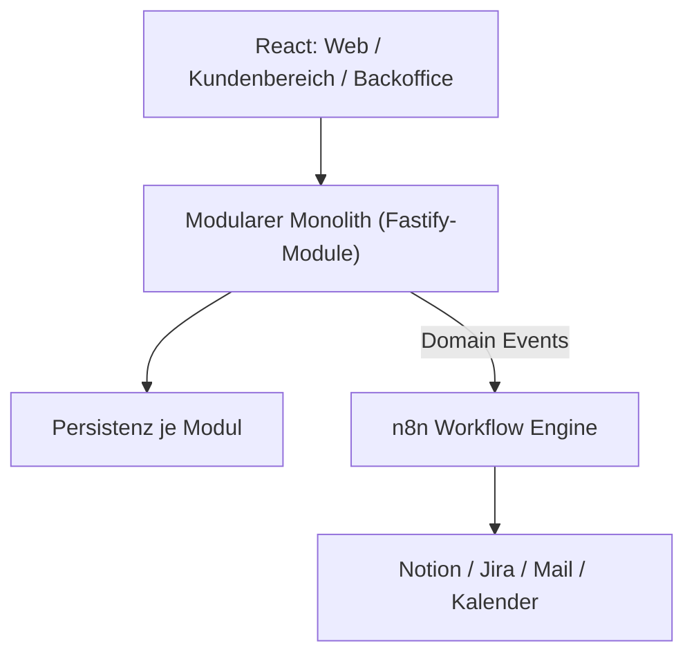

# 20 — Systemarchitektur

## Zielbild (lean)
- **Modularer Monolith** (`/services/<modul>`), je Modul: HTTP (Fastify), Domänenlogik, eigene Persistenz.
- Kommunikation zwischen Modulen nur über **öffentliche Schnittstellen** oder **Domain Events**, nie über interne Strukturen oder geteilte Tabellen.
- **n8n** als Workflow-/Orchestrierungs-Schicht (extern: Notion, Jira, Mail, Kalender). Wird eingezogen, sobald >1 Modul existiert.
- **API-Gateway (Traefik)** erst bei mehreren externen Einstiegspunkten.

## Spätere Evolution (nur bei echtem Bedarf)
Microservices, je eigene DB, Domain Events über Gateway — wie in der Video-Analyse, aber bewusst aufgeschoben.

## Diagramm (Zielzustand)

