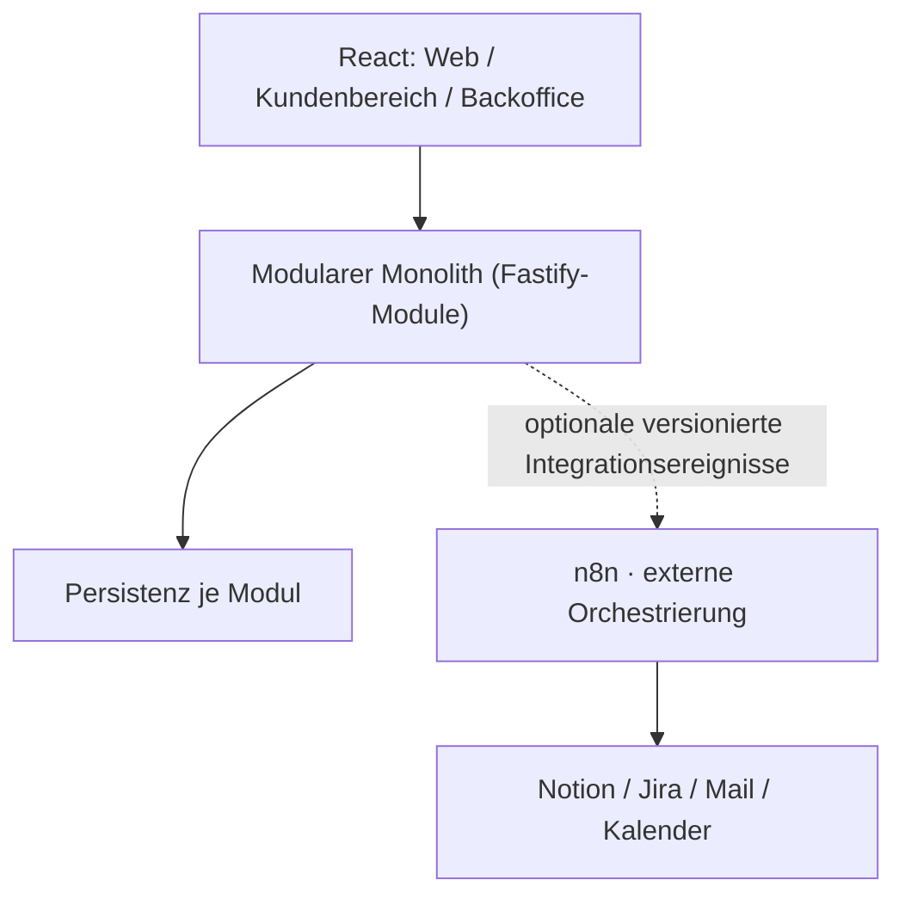

# 20 — Systemarchitektur

## Zielbild (lean)
- **Modularer Monolith** (`/services/<modul>`) als fachlicher Kern und ein Release-Artefakt.
- Je Modul: öffentliche API, Domänenlogik und eigener Persistenzvertrag. Eine gemeinsame
  PostgreSQL-Instanz ist zulässig; direkte Zugriffe auf Tabellen anderer Module sind verboten.
- Kommunikation zwischen Modulen nur über **öffentliche Schnittstellen** oder ausdrücklich
  versionierte **Domain Events**, nie über interne Strukturen.
- Externe Prozessgrenzen sind für PostgreSQL, Objekt-/Vector Store, KI-Provider, Integrationen und
  später durable Jobs zulässig. Sie werden dadurch nicht Eigentümer fachlicher Wahrheit.
- **n8n** wird nur für einen konkret entschiedenen externen Integrationsworkflow eingeführt. Es
  trägt niemals Knowledge Objects, Answer Evidence, Validierung, Konflikte, Gaps oder Auditwahrheit.
- **API-Gateway (Traefik)** erst bei mehreren externen Einstiegspunkten oder nach freigegebenem
  Horizontal-Scale-Gate.

## Spätere Evolution (nur bei belegtem Bedarf)

Microservices sind keine allgemeine Zielstufe. Eine Extraktion benötigt einen eigenen ADR und
mindestens einen belegten Treiber: deutlich abweichende Skalierung, notwendige Fehlerisolation,
eigenes verantwortliches Team/Releasefenster, abweichende Datenresidenz oder gemessene
Ressourcengefährdung des Kerns.

Horizontale App-Replikation benötigt vorher durable/idempotente Jobs, Distributed Locks oder eine
Leader-Regel, instanzweite Limits, koordinierte Migration/Projektionsaktivierung sowie Last- und
Failovertests. Der vollständige Vertrag steht in ADR
`KW-ADR-ARCH-001_MODULARER_MONOLITH_MIT_PROCESS_SEAMS` im Kontrollworkspace.

## Diagramm (Zielzustand)

```mermaid
flowchart TB
    UI["React: Web / Kundenbereich / Backoffice"] --> APP["Modularer Monolith (Fastify-Module)"]
    APP --> DB["Persistenz je Modul"]
    APP -.->|"optionale versionierte Integrationsereignisse"| WF["n8n · externe Orchestrierung"]
    WF --> EXT["Notion / Jira / Mail / Kalender"]
```
